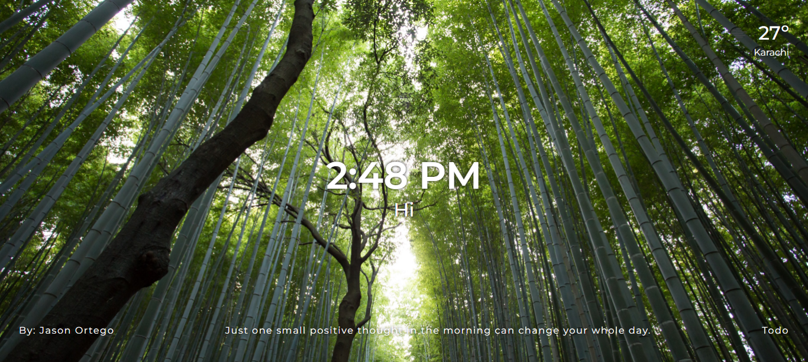

# Chrome dashboard

Chrome personal dashboard built with Vanilla JavaScript. New background images are displayed using Unsplash api, current weather based on user's location is displayed on the page using open weather map api, and quotes are displayed using quotable api. The user can select keep record of daily main focus and todo list which is automatically updated every 24 hours. This project is a part of Scrimba front-end developer career path.

# Demo
[Live site URL](https://personalchromedashboard.netlify.app/)

# Built with
* HTML5
* CSS Flexbox
* Vanilla JavaScript

## Authors
- GitHub: [ToobaJamal](https://github.com/ToobaJamal)
- LinkedIn: [Tooba Jamal](https://www.linkedin.com/in/tooba-jamal/)

## License
[MIT](https://choosealicense.com/licenses/mit/)
